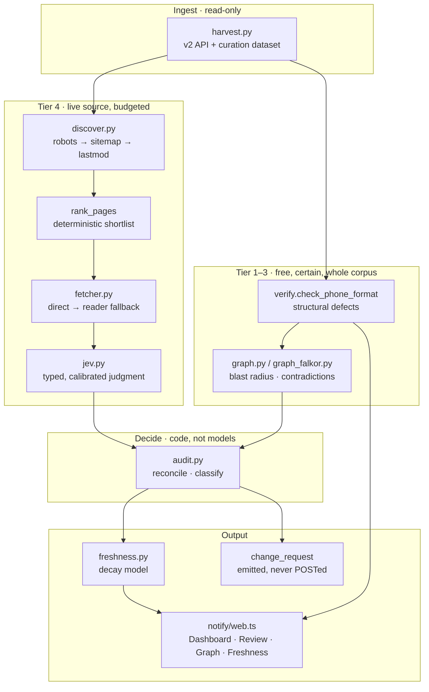
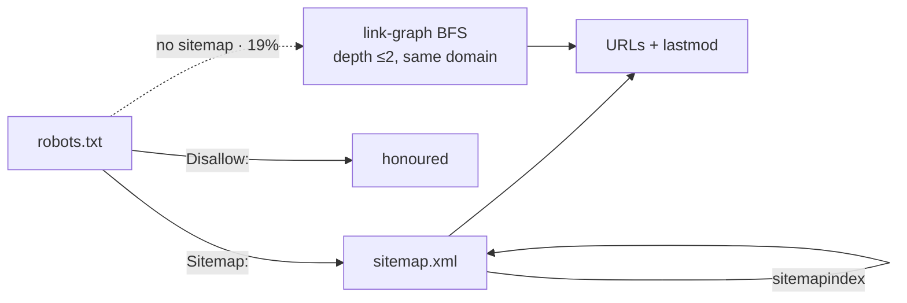
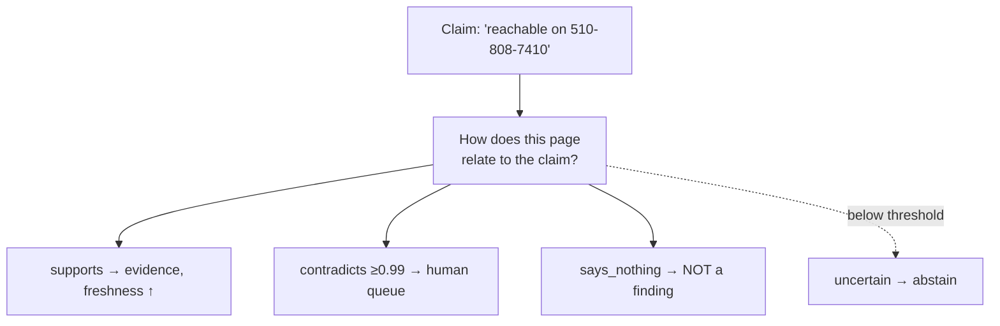

# Architecture

> [PROBLEM.md](PROBLEM.md) says why. This says how. [JOURNAL.md](JOURNAL.md)
> says what it took, including the parts that were wrong.

## The whole system



## The two questions

Everything here answers one of two questions, and they need different machinery.

**"What is broken?"** — provably wrong from the stored value alone. Free to detect,
certain, fixable today. 8 of 813 listings.

**"What has expired?"** — probably fine, but nothing in the record says anyone
confirmed it. Not an error. A shelf life. Most of the directory.

## Tier 1 — structural

No model, no network, whole corpus, cannot false-positive. Finds:

```
Building Futures      label "510-808-7410",  number empty  → tel:null
SF LGBT Center        label "(415) 865-5521", number empty
SF311 (TTY)           "057 012 31 17", country_code CH     → renders Swiss
Internet For All Now  "41574423832383"                      → 14 digits
```

The `country_code CH` class is a parser bug upstream: something read a US area code
as an international dialling code and stored the remainder.

Also exploratory, not yet shipped as a module: **75 schedule rows across 15
organisations close before they open** — `Simply the Basics` stores Mon–Fri as
`0900 → 0500`, a "9 to 5" PM-conversion error.

> `BRIEF.md` quotes 32 across 13 for this; my re-measure walked resource-level
> schedules only and counted rows. The two have not been reconciled — flagged
> rather than silently overwritten.

## Tier 4 — the live-source loop

This is the part that was rebuilt, and the part that can be wrong.

### Discovery: ask the site what it has

The previous version had:

```python
SUBPAGES = ["/contact", "/about", "/hours", "/visit", "/locations"]
```

Five guesses, tried against every organisation. `discover.py` replaces it:



Measured on 60 random corpus sites:

| | |
|---|---|
| Sitemap found | **49/60 (81%)** — 32 declared in `robots.txt` |
| Carrying `<lastmod>` | 39/60 (65%) |
| No sitemap → BFS | 11/60 (19%) |

**`<lastmod>` is a signal the project did not previously have.** Everything else
infers staleness from ShelterTech's `updated_at` — when the *directory* changed.
This is when the *source* changed. It also exposes stale duplicates directly:

```
/services/domestic-violence/     lastmod 2026-09-04   ← canonical
/services/domestic-violence-2/   lastmod 2022-11-16   ← four years stale
```

### Ranking: spend the fetch budget well

Deterministic, free, before any model call. Slug words matched against per-field
hints, with penalties for news/event/archive shapes and a weak recency tiebreak.

Recency is deliberately weak: nonprofit sites publish constantly, so a gala page is
often the *freshest* page on the site. A stale `/contact/` is a better witness to a
phone number than a fresh `/gala-night/`.

### Fetching: two tiers

`fetcher.fetch` tries a plain GET, then a rendering reader when what comes back is
a JavaScript shell. This matters more than it sounds: the first version of
`audit.py` re-implemented only the plain GET and went blind on **4 of 12** sampled
organisations. With the fallback, 0 of 12.

### Judgment: typed and calibrated

`jev.py` wraps TypeSafe's Jev, which emits **no strings at all** — you supply a
state and typed questions, it returns probability distributions over answers you
defined. Two consequences:

1. **It cannot fabricate a citation.** Asked to choose among spans we built from
   bytes we fetched, a cited span is real by construction. A generative model can
   invent a quote; we had to add a check that quotes appear in the source. That
   whole class of error disappears.
2. **The probability is trained to mean something** — RLCD targets answers given
   90% probability being right about 90% of the time.

**One three-way Choice per claim**, which is TypeSafe's documented
[citation-check pattern](https://docs.typesafe.ai/cookbooks/citation_check):



The important property: **`says_nothing` is an option the model selects**, not a
state my code infers when two separate probabilities both come back low. Conflating
"the page is silent" with "the page disagrees" is the error behind most of what
this project has retracted, and an explicit option is a stronger guarantee than an
inference rule.

This project started with two independent nouls. It changed because of a
measurement, not a preference — `calibrate.py` scored both against the same 444
rows:

| | AUROC | contradictions at ≥0.99 | of which wrong |
|---|---|---|---|
| Two nouls | 0.983 | **0** — cannot accuse at all at that bar | — |
| | | at ≥0.90: 14 | **5 (36%)** |
| **Three-way Choice** | **0.992** | **12** | **0** |

A verifier that can never raise a contradiction is not a verifier; one that is
wrong a third of the time is worse. The Choice form is the only one that can
accuse safely. It also costs one question instead of two.

### Calibration

Thresholds are measured, not chosen. 444 (claim, page) rows over 43 organisations,
split **by organisation** so no site's page text crosses the split. Ground truth is
a mechanical oracle — does the stored value appear, normalised, in the fetched page
— so nothing grades its own work. Rows the oracle cannot decide are **excluded**
rather than guessed.

```
support    >= 0.69    held out: precision 1.000, recall 0.867  (tp 65, fp 0, fn 10)
contradict >= 0.99    held out: 12 flagged, 0 of them actually on the page
ECE 0.042 · AUROC 0.992
```

Both sit at the **middle of the plateau** of thresholds tying at best precision on
the calibration half, not at its edge. Edge-picking overfitted: the first objective
maximised recall subject to precision, chose 0.19, scored 0.958 on calibration and
fell to 0.932 held out — below the target it was selected to meet.

**This measures faithfulness, not factuality.** It shows the judge reads pages
correctly. It does not show the directory is wrong where the judge says so — a
phone number can be correct and simply unpublished.

### Reconciliation: one witness beats two silences

Across pages, support outranks contradiction, and contradiction only stands when
nothing supports.

This is the Building Futures lesson encoded. Its stored number is absent from the
homepage and from `/services/domestic-violence/`, and present on `/get-help/`. Two
silences, one agreement. **The number is correct.** Majority voting would have
condemned it.

## What each part may and may not do

| Component | May | May **not** |
|---|---|---|
| Structural checks | publish a finding | — |
| Graph | rank, find blast radius | publish a finding alone |
| Jev | screen, score, abstain | publish a finding alone |
| Agent | navigate, extract, stop | judge |
| Human | accept, reject, confirm | — |

Jev scores ~68% on TypeSafe's own four-workflow benchmark. That is fine for
screening and disqualifying for adjudication — which is why nothing in the model
layer is authorised to produce a finding by itself.

## Cost and scale, measured

| | |
|---|---|
| Per organisation | **$0.000316**, ~1.3s |
| Full corpus (813) | **~$0.26** |
| Calibration corpus | 444 claim/page rows, 43 orgs |
| Wall clock, 4 workers | 16.0s for 12 orgs |

Real findings the calibrated pipeline raises, each verified by hand afterwards:

| Organisation | Directory says | Their own site says |
|---|---|---|
| Order of Malta Clinic | `(510) 587-2999` · `2120 Harrison` | `(510) 587-3000` · `2121 Harrison St` |
| Getting Out & Staying Out | `(415) 489-7300` | `212-831-5020` — the site is `gosonyc.org`, a New York organisation |
| Community Forward SF | `(415) 223-1416` | `415 223 1419` |

All three are candidates for a human, not assertions. Two are single-digit
differences, which is what a transcription error looks like; the third suggests the
listing points at the wrong organisation's website entirely.

## Safety properties

| Property | How it is enforced |
|---|---|
| Read-only against the Service Guide | every request is a `GET`; `change_request` written to disk |
| No SSRF | `registered_domain` allowlist; tested against loopback, link-local, and `bfwc.org.evil.test` |
| No path traversal | `path.resolve` + containment check in `notify/web.ts` |
| Polite crawling | `robots.txt` honoured, budgets, no parallel requests to one host, identifying UA |
| Fails safe | every failure path returns an abstention with a note, never a verdict |

## Testing

```
tests/          34 offline tests, 0.06s, no API key, no network
crosscheck.py   full-corpus gate: both graph backends must agree on every
                query over 816 orgs and 230 contradictions. Exits non-zero.
CI              lint + offline tests + tsc only
```

CI deliberately excludes anything touching a live nonprofit's site, a paid model or
FalkorDB. A pipeline that goes red for reasons nobody controls teaches people to
ignore it.

## Known weaknesses

- **Calibration measures faithfulness, not factuality.** The oracle asks whether
  the stored value appears on the fetched page, not whether it is true in the
  world. A correct phone number that a nonprofit simply does not publish is
  scored the same as a wrong one. Human review of the findings themselves is the
  missing piece.
- **43 organisations is a small sample.** The thresholds are plateau midpoints,
  which is the robust choice, but the plateau was measured on 444 rows.
- **Half-lives and weights are judgement**, never fitted. The right method is to
  mine ShelterTech's change-request history for how often each field changes.
- **Prose claims are not extracted yet.** `extract_claims(include_prose=True)` is a
  placeholder; eligibility and application-process text needs a cached generation
  step that does not exist.
- **iMessage does not deliver.** Auth works, provider enabled, recipient
  allowlisted; the shared-line pool refuses. Account provisioning, not code.
- **v2 is not perfect either** — ~0.1% of records carry bad `country_code` at the
  database level, so the live site renders them wrong too.
