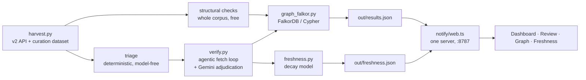

# SF Service Guide Watch — full brief

Assume you know nothing about this project. This file tells you everything.

Location: `~/Projects/darcel-watch` · Built 19 Sep 2026 at Hack for Humanity SF.

---

## 1. What problem this solves

San Franciscans who need food, a shelter bed, a clinic or legal aid find those
services through **SF Service Guide** (`sfserviceguide.org`), run by the nonprofit
**ShelterTech**: 1,759 organisations, 7,577 services, ~16,000 users a month. It is
open source, and it already has a chatbot (`casey`) and a phone line (`VACS`).

We set out to build an AI resource finder. We searched for prior art first and
found ShelterTech had built it twice already. A sixteenth directory would have
been pointless, so we asked what is actually broken about the one that exists.

Their listings are vetted by volunteers at monthly datathons — human hours they do
not have enough of.

**Measured against their live API:**

| | |
|---|---|
| Approved organisations (live to users) | **813** |
| Never verified *or* certified by anyone | **598 (73.6%)** |
| The 215 that were verified — median age | **7.7 years** |
| Verified within the last three years | **8** |

The gap is not discovery. It is **freshness**.

---

## 2. What we built

Two things, which answer different questions.

**"What is broken?"** — provably wrong right now, from the stored value alone.
Free to detect, certain, fixable today.

**"What has expired?"** — probably fine, but nobody has confirmed it in years.
Not an error. A shelf life.

It is **read-only against the SF Service Guide**: every request to their API
is a GET. We never write to it. Every output is a
candidate for a human, never an assertion.



---

## 3. The four tiers — the core design idea

Verification sorts by cost, and by how wrong it can be:

| Tier | Question | Cost | Can it false-positive? |
|---|---|---|---|
| **1 Structural** | Is this value well-formed? | free | **No** |
| **2 Cross-field** | Do stored values agree with each other? | free | Rarely |
| **3 Graph** | Does it agree with related records? | cheap | Rarely |
| **4 Live source** | Does the org's own site agree? | expensive | **Yes, constantly** |

We built tier 4 first and got burned three times. Every finding that survived
scrutiny came from tiers 1–3. Structural checks now run over the whole corpus,
because rationing a free check behind a budget meant for network and token spend
was always wrong.

---

## 4. The findings

**8 of 813 approved listings** have a phone defect provable from the stored value.
The strongest class: the number is typed into the *label* column and the `number`
field is empty, so the listing's Call button links to **`tel:null`**.

```
Building Futures (domestic violence)   label "510-808-7410",   number empty
SF LGBT Center                         label "(415) 865-5521", number empty
Calvary Street Ministries              label "(415) 333-3017", number empty
Larkin Street Youth Clinic             label "Voice",          number empty
Pilipino Senior Resource Center        label "Call for more information"
SF311 (TTY line)                       "057 012 31 17", country_code CH
Toolworks (ASL line)                   "57330990613",   country_code CH
Internet For All Now                   "41574423832383" — two numbers in one field
```

Verified in a real browser: `telLinks: ["tel:null","tel:null"]` while the number
is printed right beside it. A judge can check it on their phone in ten seconds.

**The model asserted nothing.** Across 80 listings: 0 model discrepancies,
23 abstentions, 57 matches. That is the design working — we tightened the
adjudication prompt twice to make it more conservative.

---

## 5. The freshness index

Every field carries a promise with a shelf life. Confidence decays on a per-field
half-life; the evidence that supports it has a ceiling.

```
half-lives     schedule 180d · phone 1095d · address 1095d · website 730d

evidence       human_verified   100   someone checked it against reality
               source_agreement  90   the org's own site agrees
               structural_ok     40   well-formed. Says nothing about currency.
               none               0
```

The **40 ceiling** is the load-bearing idea: a perfectly formatted phone number
for an organisation that closed in 2019 is still perfectly formatted. Only the
source or a human proves currency.

Directory today: **median 36.2/100** · 22 fresh · 586 stale · 205 expired.
Each listing carries a **next action** — the one cheapest thing that would most
raise its score. Estimated **~204 volunteer-hours** to move the median to 70.

A "match" from an agent run counts as a confirmation and raises the index. That
is the loop: the agent running is what makes the number move.

---

## 6. Running it

```bash
cd ~/Projects/darcel-watch
docker start falkordb
npm run web                  # everything at http://127.0.0.1:8787/
```

Secrets live in `.env` (gitignored) — nothing needs exporting. `.env.example`
documents the shape.

To regenerate findings: `BUDGET=25 .venv/bin/python run.py` then
`.venv/bin/python freshness.py`. **Use the venv interpreter** — the FalkorDB
client is not installed system-wide and plain `python3` silently falls back to
the in-memory graph.

---

## 7. The files

| File | What it does |
|---|---|
| `harvest.py` | Pulls from the **v2** API (`sfserviceguide.org/api/v2`) and ShelterTech's own curation dataset. Caches to `data_v2/`. |
| `verify.py` | The agent: fetches the org's site, decides where to look next, adjudicates, abstains. Plus the structural checks. |
| `run.py` | Orchestrator. Emits `out/results.json` and `out/graph.json`. |
| `freshness.py` | The decay model. Emits `out/freshness.json`. |
| `graph.py` / `graph_falkor.py` | In-memory and FalkorDB backends, same interface. |
| `crosscheck.py` | Asserts the two graph backends agree over the whole corpus: 816 orgs, all 230 contradictions in published order, subgraph export. Exits non-zero on any mismatch. |
| `notify/session.ts` | The review state machine. Transport-agnostic. |
| `notify/web.ts` | The application server. Four pages, 11 routes, live audit over SSE. |
| `notify/spectrum.ts` | Real Spectrum client — terminal works, iMessage does not deliver. |
| `ui/*.html` | Dashboard, Review, Graph, Freshness. No framework, no build step. |

---

## 8. Known weaknesses — say these before a judge finds them

- **We audited the wrong API for most of the build.** v1 (`askdarcel.org/api`)
  mangles US area codes into international dialling codes — 510 became Peru,
  209 became Egypt. Every phone finding we had was an artifact of it. The whole
  data layer moved to v2, the one the website actually uses.
- **The half-lives are our judgement, not measurements.** The right way is to
  measure how often each field actually changes, from their change-request
  history.
- **iMessage does not deliver.** Auth works, the provider is enabled, the
  recipient is allowlisted — the shared-line pool still refuses. Account
  provisioning, not our code.
- **The schedule finding is exploratory**, not a shipped module: 32 entries
  across 13 orgs close before they open, 20 of them PM-conversion errors
  ("9 to 5" stored as 09:00–05:00).
- **v2 is not perfect either** — about 0.1% of records carry the same bad
  `country_code` at the database level, so v2 renders them wrong too.

---

## 9. Four bugs we caught ourselves

1. A careers-page number read as a main line (Sutter Health).
2. A change request proposing to change an address to itself.
3. Comparing only the first of ten stored phone numbers.
4. Reading the wrong API entirely.

All four found by reading our own output. Two of them by a human opening the
actual listing — which is precisely what the human in the loop is for.

Named for **Darcel Jackson**, who founded ShelterTech after being injured as a
welder and becoming unhoused.
