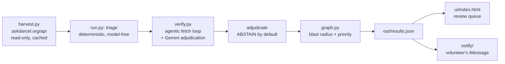

# SF Service Guide Watch — full brief

Assume you know nothing about this project. This file tells you everything.

Location: `~/Projects/darcel-watch` · Built 19 Sep 2026 at Hack for Humanity SF.

---

## 1. What problem this solves

San Franciscans who need food, a shelter bed, a clinic, or legal aid find those
services through **SF Service Guide** (`sfserviceguide.org`), run by the nonprofit
**ShelterTech**. It is real infrastructure: 1,759 organisations, 7,577 services,
~16,000 users a month. It is open source, and it has a chatbot (`casey`) and a
phone line (`VACS-MVP`).

We originally planned to build an AI resource finder. We searched for prior art
first and found ShelterTech had already built it — twice. Building a 16th
directory would have been pointless.

So we asked what is actually broken about the one that exists. Their listings are
vetted by volunteers at monthly datathons — human hours they do not have enough of.

**We measured it during the hackathon**, against their live public API:

| Measurement | Result |
|---|---|
| Resource records sampled | 156 |
| Marked `approved` (live to users right now) | 138 |
| **Of those, never verified once (`verified_at: null`)** | **126** |
| Remaining approved records that carry a verification date | 12 |
| Median age of those 12 | **2,838 days (~7.8 years)** |
| Verified within the past year | **0** |
| Approved listings with a website we can check | 120 |

All 12 verification dates, in full — the entire verified history in the sample:

```
3002d  2018-07-01  FranDelJA Enrichment Center
2998d  2018-07-05  Lawyers' Committee for Civil Rights of the SF Bay Area
2978d  2018-07-25  HEP B Free - San Francisco
2894d  2018-10-17  San Francisco Bay Area Theatre Company
2894d  2018-10-17  San Francisco University High School
2838d  2018-12-12  Civic Center Plaza
2838d  2018-12-12  California Department of Social Services
2838d  2018-12-12  10,000 Degrees
2703d  2019-04-26  Epiphany Center
2329d  2020-05-04  San Francisco Immigration Court
2329d  2020-05-04  Italian Community Services
2184d  2020-09-26  California Department of Vocational Rehabilitation
```

Every verification happened between July 2018 and September 2020. Nothing since.
The repeated dates are single datathon sessions — you can see the volunteer
batches in the timestamps.

An earlier, smaller sample (122 records, 108 approved, 98 never verified,
10 dated) gave the same picture. Reproduce either with `python3 run.py`.

The gap is not discovery. It is **freshness**. A wrong shelter address at 9pm is
worse than no answer at all.

---

## 2. What we built

An agent that re-verifies listings against each organisation's own live website,
models the directory as a graph so one closure propagates to everything connected
to it, **abstains when the evidence is weak**, and emits a ranked change-request
queue in the shape ShelterTech's volunteers already work with.

It is **read-only against production**. We never POST to their API. Every output
is a candidate for a human to review, never an assertion of fact.



---

## 3. The files

| File | What it does |
|---|---|
| `harvest.py` | Pulls resources from `askdarcel.org/api` (public, unauthenticated). Caches to `data/` so repeat runs don't hammer them. |
| `graph.py` | Builds the graph and runs the three queries that depend on it. Zero dependencies — an adjacency dict is correct at this scale. |
| `verify.py` | The agent. Fetches the org's site, decides where to look next, adjudicates, abstains. |
| `run.py` | Orchestrator: harvest → triage → verify → rank → emit `out/results.json`. |
| `ui/index.html` | Static review queue. No framework, no build step. Falls back to embedded demo data so it never renders blank. |
| `notify/dry_run.py` | Renders the volunteer's iMessage conversation in the terminal. **This is what you demo.** |
| `notify/session.ts` | The review state machine. Transport-agnostic — knows nothing about HTTP or Spectrum. |
| `notify/web.ts` | The application server on :8787. Serves all three pages and the API, spawns audit runs, streams progress over SSE. |
| `notify/spectrum.ts` | Real Spectrum client. Terminal transport works with no credentials; iMessage is wired but undelivered. |
| `ui/review.html` | The review thread. |
| `ui/graph.html` | Graph explorer — click an org to see its blast radius. |
| `graph_falkor.py` | FalkorDB backend. Real Cypher. |
| `crosscheck.py` | Parity harness proving both graph backends agree. |

### The agentic loop (`verify.py`)

Not a prompt chain. Per listing:

1. Fetch the homepage.
2. Extract candidate evidence: phone, hours, address, closure language.
3. **If the evidence is insufficient, the agent decides where to look next** —
   tries `/contact`, `/about`, `/hours`, `/visit`, `/locations`. Capped at 3 fetches.
4. Adjudicate.
5. **Abstain** if the site is unreachable, is a JS-only shell, or the evidence is
   ambiguous. Abstention is a first-class outcome, reported as a headline number.

### Why the graph is load-bearing (`graph.py`)

The directory *is* a graph: Org → Service → Category, Org → Address, Org → Phone.
Three features exist only because of it:

- **`blast_radius`** — one org closing invalidates every service beneath it plus
  co-located orgs. One traversal. Measured max: **36**.
- **`contradictions`** — distinct org names sharing one phone or address. Found 9.
  Real example: `415-831-2700` is shared by Miraloma Playground Clubhouse, Civic
  Center Plaza, and Laurel Hill Playground — three listings, one switchboard.
- **`propagate_staleness`** — doubt decays outward along edges and ranks the queue.

Ranking: `priority = confidence * (1 + blast_radius_size * 0.15)`. Confidence
alone is a bad rank; a wrong record invalidating twelve services deserves a
volunteer's attention before a high-confidence typo.

**The graph runs on FalkorDB (Docker, Cypher) via `graph_falkor.py`, with
`graph.py` as a zero-dependency fallback when the database is unreachable.
`crosscheck.py` proves they agree — 156 orgs, every contradiction, hops 1-4,
subgraph extraction, zero mismatches. Run the pipeline with `.venv/bin/python`
or the FalkorDB client isn't importable and it silently falls back.**

### Triage (`run.py`)

Deterministic, no model calls. Ranks by: never-verified + critical category
(shelter/food/health/legal/crisis/hygiene) + has a checkable website. The cheap
classical step guards the expensive model step.

---

## 4. How to run it

```bash
cd ~/Projects/darcel-watch
docker start falkordb
export OPENROUTER_API_KEY=sk-or-...
npm run web                      # everything at http://127.0.0.1:8787/
```

Dashboard, review queue and graph explorer are all served from that one URL, and
the Run button triggers a live audit streamed over SSE.

To run the pipeline directly: `BUDGET=25 .venv/bin/python run.py`. Use the venv
interpreter — the FalkorDB client isn't installed system-wide, and plain `python3`
silently falls back to the in-memory graph.

**Start the server without `OPENROUTER_API_KEY` and the Run button quietly
degrades to evidence-only mode.** No error, just no Gemini.

Model transport auto-detects from the key: `sk-or-…` → OpenRouter,
anything else → Google AI Studio direct. `DW_MODEL` overrides the model slug.
**With no key at all it still runs end to end** in evidence-only mode, using the
deterministic adjudicator.

---

## 5. Current verified state

Last full run (BUDGET=25): 156 records → 1,158-node graph (FalkorDB) →
**2 discrepancies, 10 abstentions**, 9 contradictions.

Both discrepancies are structural — found by digit-count arithmetic, no model
involved, so they cannot be false positives:

> **MKL Rehab – Addiction Treatment Helpline** — stored `94410046`. Eight digits.
> Cannot be dialled.
> **Oakland Healthcare & Wellness** — stored `02508000`. Same fault.

Corpus-wide: **24 of 189 stored phone numbers (13%) are not dialable as stored** —
20 truncated below 10 digits — across 19 of 138 approved listings.

Every model-adjudicated case in this run came back *abstain*, including a number
that turned out to be a Zoom meeting ID. That is the intended behaviour: the cheap
structural check carries the confident findings, the model handles judgement and
says so when it can't.

---

## 6. Known weaknesses — say these before a judge finds them

- **Vanity numbers.** The regex cannot read `415-826-KIDS (5437)`. It flagged
  Dance Mission Theater as a discrepancy when the stored number was correct.
  This is exactly the case Gemini adjudication catches — deterministic code
  gathers, the model judges.
- **The Gemini/OpenRouter path is not smoke-tested against a live key.** Run it
  once before demoing, not during.
- **iMessage has never delivered a message.** Auth works, the provider is enabled,
  the recipient is allowlisted — the shared-line pool still refuses with "Target
  not allowed for this project". Account provisioning, not our code. The terminal
  and web transports work with no credentials at all.
- **Small sample.** 156 of 1,759 resources. The finding is a sample, not a census.

---

## 7. What's next

Offer it to ShelterTech. We are not competing with them — we are trying to make
their most expensive job cheaper. The change requests are already shaped for the
endpoint their volunteers use.

Named for **Darcel Jackson**, who founded ShelterTech after being injured as a
welder and becoming unhoused.
