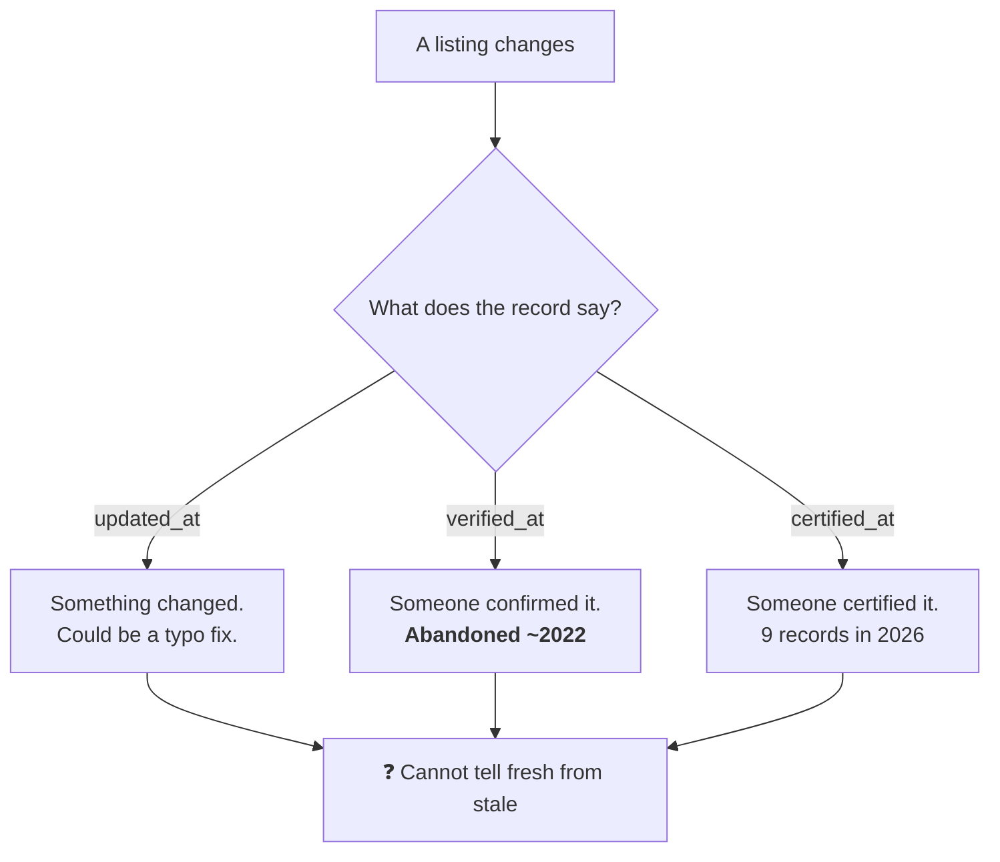

# The problem

> Every number here is in [`FACTS.md`](FACTS.md) with how it was established.
> Six claims have already been retracted from this project. If a figure appears
> here and not there, this file is wrong.

## In one sentence

San Francisco's civic service directory is **actively maintained but carries no
record of what has actually been confirmed** — so nobody, including the people
who maintain it, can tell a listing someone checked last week from one nobody
has checked since 2019.

## Who this is about

**ShelterTech** is a nonprofit that runs the [SF Service Guide](https://sfserviceguide.org):
1,759 organisations and 7,577 services, counted from their live API. Shelter beds,
food programmes, clinics, legal aid, domestic violence support. They report 16,000+
monthly users. It is open source. They have built a chatbot (`casey`) and a phone
line (`VACS`) on top of it. They run it on roughly $200,000 a year with volunteers,
including people with lived experience of homelessness.

It was founded by **Darcel Jackson**, who became unhoused after being injured as a
welder, and built the thing he had needed.

**This project is not a criticism of them.** The first version of it was, and that
version was wrong. See [What we got wrong](#what-we-got-wrong).

## What is actually broken

### It is not neglect. We measured.

| | |
|---|---|
| Approved organisations | **813** |
| Updated within the last 90 days | **808** (median 53 days) |
| Updates in July 2026 / Aug / Sep | 568 / 204 / 36 |

Those updates land in bursts of 40–80 on particular working days — the shape you
would expect from datathon sessions, not a bulk migration. Whatever is wrong here,
**it is not that nobody is doing the work.**

### It is provenance.

| | |
|---|---|
| **No verification signal at all** — no `verified_at`, no `certified_at`, no `certified` flag | **523 (64.3%)** |
| Have a `verified_at` date | 144, newest **2022-10-12** |
| Have a `certified_at` date | 124, newest 2026-09-15 (only 9 in 2026) |

`updated_at` records **that something changed**. It cannot distinguish a careful
confirmation against the organisation's own website from a typo fix. The field that
*would* carry that distinction — `verified_at` — stopped being written around 2022.

So there is no machine-readable answer to *"when did a human last confirm this is
true?"* for two thirds of the directory.



## Why it matters at 2am

A directory entry is a promise: *call this number, go to this address, at these
hours, and you will get help.* Each part of that promise has a shelf life, and the
cost of it being wrong is not evenly distributed.

A wrong restaurant listing wastes a journey. A wrong shelter address at 9pm in
February means someone sleeps outside. A dead crisis line means a call that does
not connect.

**This is not hypothetical.** Verified in a browser on the live site:

```
sfserviceguide.org/organizations/2399    (Building Futures, domestic violence)
  telLinks: ["tel:null", "tel:null"]
  page text contains "510-808-7410": true
```

The number is printed on the page. The Call button dials `null`, because someone
typed the number into the *label* column and left `number` empty. The same fault
affects the SF LGBT Center (2346) and Calvary Street Ministries (2087).

Worse, on that same listing: the organisation's **real 24-hour crisis line,
1-866-292-9688**, appears only inside a description paragraph. It is not in the
structured phone data at all. Someone in crisis gets a dead button while the
working line sits in prose no software can dial.

Three of the eight structural defects we found are **accessibility or crisis
lines** — TTY, ASL, domestic violence. Those are the rows a volunteer fills in
last, in a differently-shaped form field, and the ones where failure costs most.

## Why this is hard

Verification sorts by cost, and by how wrong it can be:

| Tier | Question | Cost | Can it false-positive? |
|---|---|---|---|
| **1 Structural** | Is this value well-formed? | free | **No** |
| **2 Cross-field** | Do stored values agree with each other? | free | Rarely |
| **3 Graph** | Does it agree with related records? | cheap | Rarely |
| **4 Live source** | Does the organisation's own site agree? | expensive | **Yes, constantly** |

Tier 1 finds 8 defects across 813 listings. Real, certain, fixable today — and
nowhere near the size of the problem, because **most of the directory is prose**:

```
3,340  long_description      3,308  eligibilities
2,913  application_process   1,483  fee
  855  required_documents      379  wait_time
```

There is no structural check for an eligibility paragraph. A sentence cannot be
malformed the way a phone number can. *"Open to adults 18+ with proof of SF
residency"* is well-formed whether or not it has been true since 2021.

So the majority of the data is reachable **only** at tier 4 — and tier 4 is where
every retracted finding in this project came from.

### The asymmetry that makes tier 4 dangerous

Confirming and contradicting are not mirror images.

- **Corroboration is safe.** If we agree with a stored value, nothing changes.
- **Contradiction is dangerous.** If we are wrong, a volunteer may replace a
  working phone number with a broken one, on our say-so.

And the trap underneath it: **absence of evidence looks identical to evidence of
absence.** A page that does not mention a number and a page that contradicts it
produce the same silence unless you deliberately ask two different questions.

This project came within one step of filing exactly that error against a domestic
violence service. See [JOURNAL.md](JOURNAL.md).

## What we got wrong

The founding premise of this project was **false**, and correcting it made the
problem smaller and truer.

| Claimed | Reality |
|---|---|
| "73.6% have never been verified" | Measured `verified_at`, a field abandoned around 2022. A dead field, not neglect. |
| "Volunteers at monthly datathons can't keep up" | The directory is actively maintained — 808 of 813 updated within 90 days. Datathons are biweekly, per a help-centre article dated **5 November 2019**, so today's cadence is unknown. |

The honest number is **523 of 813 (64.3%)** with no verification signal at all.
All six retractions, with provenance, are in [`FACTS.md`](FACTS.md) section E.

## What would count as solving it

1. Every field carries a **freshness score** with an explicit basis — who confirmed
   it, against what, how long ago.
2. **Provable defects** are found without a model, and therefore without doubt.
3. Prose fields get a verdict that is **honest about uncertainty**: supported,
   contradicted, absent, or unknown — never a guess dressed as a finding.
4. A volunteer opening the queue sees **the cheapest next action** that most raises
   the directory's trustworthiness.
5. **False-positive rate is measured on held-out data**, not asserted.

Point 5 is not done. Everything claimed about model accuracy in this repo is
currently fitted rather than held out, and labelled as such.

---

Next: [VISION.md](VISION.md) — what this becomes ·
[ARCHITECTURE.md](ARCHITECTURE.md) — how it works ·
[JOURNAL.md](JOURNAL.md) — what it took, including the wrong turns
