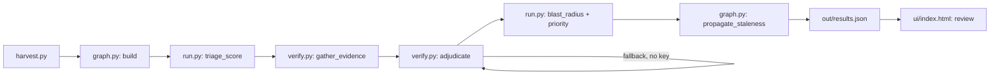

# SF Service Guide Watch

Named for Darcel Jackson, who founded ShelterTech after being injured as a welder in San Francisco and becoming unhoused. ShelterTech built the SF Service Guide so the next person in that situation could find help. SF Service Guide Watch exists to keep that guide accurate.

Built at Hack for Humanity: San Francisco, 19 Sep 2026 (Entrepreneurs First, co-hosted by MLH, powered by Google Gemini). Built at a hackathon.

## What it is

We set out to build an AI resource finder for San Franciscans needing food, shelter, healthcare, legal aid. We searched first. It already exists: ShelterTech's [SF Service Guide](https://sfserviceguide.org) — 1,759 organisations, 7,577 services, ~16,000 monthly users, open source ([github.com/ShelterTechSF](https://github.com/ShelterTechSF)), with a chatbot (`casey`) and a phone line (`VACS-MVP`). Building a 16th directory would have been vanity.

So we asked what's actually broken. Their listings are vetted by volunteers at monthly datathons — human hours they don't have enough of. We measured the effect of that, live, during the hackathon, against their public unauthenticated API.

## The measured finding

Sample: 156 random resource IDs from the AskDarcel API (`askdarcel.org/api`), seed 7, IDs 1–2600.

| Metric | Count |
|---|---|
| IDs sampled | 156 |
| Marked `status: approved` (live to users) | 138 |
| Of those, `verified_at: null` (never verified) | 126 |
| Of those, carry a verification date | 12 |
| Median age of the 12 dated verifications | ~2,838 days (~7.8 years) |
| Verified in the past year | 0 |
| Of the 138, list a website we can check | 120 |

The gap in this directory is not discovery. It's freshness. A wrong shelter address at 9pm is worse than no answer.

## What it found

### The headline finding: deterministic, no model, zero false-positive risk

Before any Gemini call, a plain arithmetic check on the stored data itself — no scraping, no model, just counting digits — found this across the 138 approved listings in our sample:

```
approved listings scanned : 138
phone numbers stored      : 189
NOT dialable as stored    : 24  (13%)
  truncated (<10 digits)  : 20
  extension run into no.  :  4
listings affected         : 19 of 138
```

Twenty of those numbers are stored with the area code stripped off — too short to dial. Real examples from the sample:

| Stored (undialable) | Organisation | Label |
|---|---|---|
| `08741653` | Oakland Housing Authority | Voice |
| `02678800` | Alameda County Family Justice Center | Phone |
| `82177080` | Foster Care Mental Health | Phone |
| `05621141` | Teen Challenge Oakland Men's Center | Main |
| `07779560` | Meals on Wheels of Alameda County | Main Line |
| `02508000` | Oakland Healthcare & Wellness | Phone |

A family justice centre — domestic violence services — with a phone number nobody can call.

This check needs no model, no scraping, no judgment call. It's arithmetic on digit counts, so unlike our model-based findings below, it cannot produce a false positive. That contrast is the argument for the whole design: use the cheap deterministic check where it's sufficient on its own, and reserve the model for the genuine judgment calls a digit count can't make (is this live number actually a replacement, or a careers line?).

### The Gemini-adjudicated run

A live run with Gemini adjudication checked the 15 highest-triage-priority listings: **1 discrepancy, 7 abstained, 7 matched.** The one confirmed discrepancy: **Oakland Healthcare & Wellness** — stored `02508000` (8 digits, undialable), live site `510.250.8000`. Gemini confidence 0.95. The model-based phone check is more conservative than the count above on purpose — see the third bug below.

### Three of our own bugs, caught by looking, none by tests

**1. A false positive in the model's judgment.** The first version of the adjudication prompt flagged Sutter Health for a phone mismatch: stored `800-478-8837`, live page showed `916-297-9000`, confidence 1.0. Reading the actual quote, that number came off a careers page — a hiring line, not a replacement for the main number. The model was right that the numbers differed and wrong that the difference meant anything. We rewrote the prompt to judge purpose, not just difference: it now has to decide whether the live number plausibly replaces the stored one for the *same* purpose, and to abstain when the surrounding text suggests a different one — careers, fax, donations, a department, a second location. After the fix, Sutter Health correctly abstains: *"The live number is presented in the context of a hiring process, which is a different purpose."*

**2. A self-referential bug in our own code.** Oakland Healthcare & Wellness was initially shown to a reviewer as a discrepancy: `address: stored "3030 Webster St. Oakland 94609" → live "3030 Webster St. Oakland 94609"` — a proposed change to the exact same value. The adjudicator had reasoned about a field (phone) that no gathered evidence actually covered, and `build_change_request` fell through to whatever finding was first available, regardless of whether it genuinely differed. Fixed by requiring a field to actually differ before it's emitted at all, and downgrading to abstain when nothing gathered is actionable.

**3. A false positive in our headline finding, caught by a human.** We first flagged Meals on Wheels of Alameda County for a phone mismatch — stored `5106544000105`, live site `510.777.9560` — and proposed replacing the stored number. A human opened the actual listing. The site already lists `(510) 777-9560` as its Main Line. The listing carries ten phone numbers, one per programme or region, and `5106544000105` is `(510) 654-4000 ext. 105` — the J-Sei Nutrition Services line, correctly stored. We had proposed replacing a correct number with one that was already present, because `check_phone` only ever compared the *first* stored number: it skipped the (differently malformed) main line and compared against the second number in the list, never checking the other nine. Fixed two ways: compare against every stored number, and when a listing has many numbers and none match, report the site's number as a possible *addition* rather than proposing to replace an arbitrary one.

This third bug is the strongest argument for the human-in-the-loop design in this whole project: **the human in our loop caught the agent, exactly as designed.** Nothing here shipped straight to ShelterTech — every output is a candidate, and this is what "candidate" is for.

## What it does

An agent that re-verifies approved listings against each org's live website, models the directory as a graph so one closure propagates to everything connected to it, abstains when evidence is weak, and emits a ranked change-request queue in the shape ShelterTech's own review workflow already expects. It never writes to their production system.

## Architecture



- **`harvest.py`** — pulls a random sample of resource IDs from the live AskDarcel API (`GET /resources/{id}`), read-only, unauthenticated, caches each record to `data/*.json` so repeat runs don't re-hit the API. Also reads the live corpus totals (`/resources/count`, `/services/count`).
- **`graph.py`** — models the directory as a graph: `org` nodes linked to `service`, `address`, `phone`, and `category` nodes. Our live run built a graph of **1,158 nodes**. Three things depend on this and don't exist without it:
  - `blast_radius(org)` — if an org is wrong, what else is now suspect: every service it offers, plus any other org sharing its address or phone. One traversal.
  - `contradictions()` — distinct orgs sharing the same phone or address: merge candidates or stale data. A graph pattern match, not a table scan. Our run found **9** of these.
  - `propagate_staleness(seeds)` — doubt decays outward from a confirmed-bad org along edges (org → service → neighbours), weakening with each hop. This is what ranks the review queue.
- **`verify.py`** — for each candidate record with a website: fetches the homepage, and if the evidence doesn't settle the question, walks a fixed list of likely sub-pages (`/contact`, `/about`, `/hours`, `/visit`, `/locations`) up to 3 fetches total, stopping early once it has enough signal (a closure phrase, or a matching phone + hours). It checks phone number, address, and closure/relocation language against what's stored. Findings are handed to an adjudicator:
  - **With an API key set**: Gemini 2.5 Flash judges whether the scraped quote actually contradicts the stored value and writes the one-sentence human-readable reason. Two transports call the same model — `call_model()` picks based on key shape: a key starting `sk-or-` goes over **OpenRouter** (`google/gemini-2.5-flash`, OpenAI-shaped chat completions API); anything else is treated as a Google AI Studio key and calls Gemini directly. Our live run used the OpenRouter path. The direct-Google path exists in the code and is untested by us today — don't claim we exercised it.
  - **Without a key**: a conservative deterministic fallback — only calls "discrepancy" on a positive contradiction, abstains on anything thin. The pipeline degrades gracefully: no key, no crash, still runs end to end in evidence-only mode.
  - Either path emits a `change_request` (field, current value, proposed value, source URL, source quote) only on a "discrepancy" verdict. This is never POSTed to AskDarcel — it's a payload for a human to review and submit themselves.
- **`run.py`** — orchestrates the pipeline end to end:
  1. Harvest (cached) and compute the baseline staleness stats (this is what produces the finding table above).
  2. Build the graph.
  3. **Triage** (`triage_score`) — cheap, deterministic, no model calls: ranks candidates by never-verified + critical category (shelter/food/health/legal/crisis/hygiene/etc.) + having a checkable website. This is the step that decides where to spend Gemini tokens — the classical, free filter guards the expensive model step, not the other way round. Only the top `BUDGET` (default 25) candidates go to verification.
  4. `verify.verify_many` over the triaged candidates (thread pool, network-bound).
  5. For every "discrepancy" verdict, compute `blast_radius` and a `priority = confidence * (1 + blast_radius_size * 0.15)`. Confidence alone is a bad rank — a wrong record that invalidates twelve downstream services deserves attention before a high-confidence typo.
  6. `propagate_staleness` over all discrepancy seeds to size the downstream-suspect count.
  7. Write everything to **`out/results.json`**: `generated_at`, `corpus`, `stats`, `queue` (ranked change requests), `abstained`, `contradictions`, `source`.
- **`ui/index.html`** — a static review page: loads `out/results.json` and lists each candidate change request with its verdict, confidence, priority, source URL, and verbatim quote, so a ShelterTech volunteer can accept or reject in seconds instead of re-deriving the evidence themselves.

## How to run

```bash
# 1. Harvest a sample (read-only, cached to data/)
python3 harvest.py

# 2. Run the pipeline: verify against Gemini (optional) and emit the queue
OPENROUTER_API_KEY=sk-or-... python3 run.py   # Gemini 2.5 Flash via OpenRouter (path we ran)
# GEMINI_API_KEY=...  python3 run.py           # Gemini 2.5 Flash via Google AI Studio direct (in the code, not what we demoed)
# python3 run.py                                # no key: deterministic fallback adjudicator, still end to end

# 3. Serve the review UI
python3 -m http.server 8000
# open http://localhost:8000/ui/index.html
```

## Design decisions

- **Read-only, always.** We only ever GET from `askdarcel.org/api`. We never POST. Every output is a candidate for human review, never an assertion of fact.
- **Deterministic evidence, model judgment.** Regex and string matching gather candidate evidence (phone numbers, closure phrases, zip codes). Gemini's only job is judging whether that evidence actually settles the question, and it's explicitly told to abstain rather than guess.
- **Abstention is a headline metric, not a bug we hide.** If the site is unreachable, JS-only, or the evidence is ambiguous, the verdict is "abstain" and it's reported as such.
- **Every claim carries a source URL and a verbatim quote.** No quote, no claim.
- **The graph is in-memory, on purpose.** A directory of 1,759 orgs fits comfortably in an adjacency dict — that's the right data structure at this scale, zero dependencies. FalkorDB + Cypher is the drop-in at real scale: same model (Org→Service→Category, Org→Address, Org→Phone), same three queries (`blast_radius`, `contradictions`, `propagate_staleness`). We did not use FalkorDB in this build — honesty is the point of this project, and we'd rather say what we actually shipped.
- **We are not building a 16th directory.** ShelterTech's guide, chatbot, and phone line already exist and are used by ~16,000 people a month. This tool reduces the cost of keeping their existing system accurate; it doesn't replace it.

## Limitations

- Sample size is 156 IDs out of a much larger corpus — a snapshot, not a full audit. Of those, only the top 15 by triage priority were actually checked with Gemini in our live run.
- Evidence gathering is regex-based (phone patterns, closure phrases, zip code presence) against plain-text scraped HTML — it will miss anything not phrased the way our patterns expect, and can't read JS-rendered content.
- The graph is unpersisted and rebuilt from the harvested sample each run.
- `propagate_staleness` decay/hop parameters are illustrative defaults (decay 0.5, 2 hops), not tuned against ground truth.
- Change requests are emitted, never submitted. Getting them into ShelterTech's actual review workflow requires their cooperation.

## Credits

Built against [ShelterTech](https://sheltertech.org)'s [SF Service Guide](https://sfserviceguide.org) and its public [AskDarcel](https://github.com/ShelterTechSF) API. Named for Darcel Jackson. This project only exists because ShelterTech already built and open-sourced the thing worth improving.
