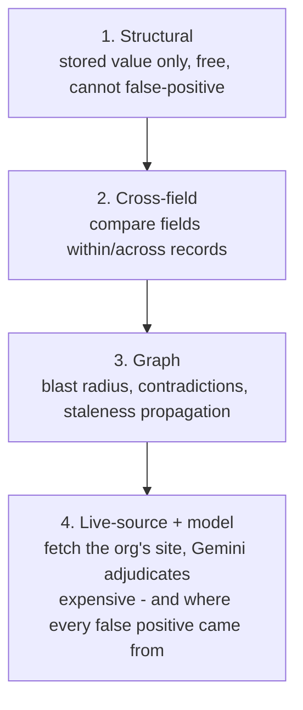
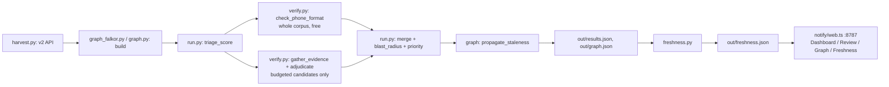

# SF Service Guide Watch

Named for Darcel Jackson, who founded ShelterTech after being injured as a welder in San Francisco and becoming unhoused. ShelterTech built the SF Service Guide so the next person in that situation could find help. SF Service Guide Watch exists to keep that guide accurate.

Built at Hack for Humanity: San Francisco, 19 Sep 2026 (Entrepreneurs First, co-hosted by MLH, powered by Google Gemini). Built at a hackathon.

## What it is

We set out to build an AI resource finder for San Franciscans needing food, shelter, healthcare, legal aid. We searched first. It already exists: ShelterTech's [SF Service Guide](https://sfserviceguide.org) — 1,759 organisations, 7,577 services, ~16,000 monthly users, open source ([github.com/ShelterTechSF](https://github.com/ShelterTechSF)), with a chatbot (`casey`) and a phone line (`VACS-MVP`). Building a 16th directory would have been vanity.

So we asked what's actually broken. Their listings are vetted by volunteers at monthly datathons — human hours they don't have enough of. We measured the effect of that, live, during the hackathon, against their own API.

## The measured baseline

Full corpus, not a sample: **813 approved organisations** in the live SF Service Guide.

| Metric | Count |
|---|---|
| Approved organisations | 813 |
| Never verified or certified by anyone | 598 (73.6%) |
| Verified or certified at some point | 215 |
| Median age of those 215 confirmations | ~7.7 years |
| Confirmed within the last 3 years | 8 |

The gap in this directory is not discovery. It's freshness. A wrong shelter address at 9pm is worse than no answer.

## What it found

### We read the wrong API, and it produced a headline finding that was wrong

Our first pass audited phone numbers through `askdarcel.org/api` (v1), the older Rails API. It reported 24 of 189 stored phone numbers as undialable — truncated below 10 digits — and we wrote that up as the project's headline finding, including a claim that an addiction-treatment helpline's number couldn't be dialled.

**That finding was an artifact, and we retracted it.** The live site (sfserviceguide.org) reads a different, newer API — `https://www.sfserviceguide.org/api/v2` — and v1's phone formatter mangles US numbers: it reads an area code as an international dialling code, so `510` becomes Peru and `209` becomes Egypt, and strips the "foreign" prefix on the way out. Verified live on resource 2258:

```
             v1 (askdarcel.org)        v2 (sfserviceguide.org, what users see)
phone 4636   "07779560"  (PE)          "(510) 777-9560"  (US)
phone 4639   "5106544000105"  (None)   "(510) 654-4000 ext. 105"  (US)
```

We were auditing a formatting bug in a superseded API, not the data anyone actually sees. Re-run against v2, the same check finds 21 of the original 23 flagged numbers are fine — including the addiction-treatment helpline, which dials correctly on the live site. We deleted the v1-based findings rather than keep any of them.

This was caught by reviewing the two runs side by side and asking whether the source for both was the same. It wasn't. That question is now the reason this project only publishes findings sourced from v2.

### The real finding: 8 of 813 approved listings have a phone defect provable from the stored value alone

No model, no scraping — arithmetic and string checks on the stored record itself, so this class of finding cannot produce a false positive. Three shapes, each one a volunteer can fix by looking at the listing:

**The number is typed into the label, and the number field is empty.** The listing's Call button links to `tel:null` while a working number is printed right next to it. Affected: **Building Futures** (domestic violence services, `510-808-7410` in the label), **San Francisco LGBT Community Center** (`(415) 865-5521`), **Larkin Street Youth Clinic** (number field empty), **Calvary Street Ministries** (`(415) 333-3017`), **Pilipino Senior Resource Center** ("call for more information", no number anywhere).

**A non-US country code on a Bay Area listing**, which means the number is parsed and dialled as a foreign number. SF311's TTY relay line is stored with a Swiss country code and renders as `057 012 31 17`, even though the same record also carries the correct `(415) 701-2311`. Toolworks has the same defect on an ASL line.

**Two values run into one field.** Internet For All Now has a 14-digit string in its phone field — two numbers, or a number and something else, concatenated.

Lead example: **Building Futures**, a domestic violence services organisation, has a Call button that dials nothing while a real number sits unused in the label one field over. A judge can load the listing and check this in ten seconds.

### The live run: structural checks carry the confident findings, the model mostly abstains

At `BUDGET=25` against the full v2-sourced corpus, the current run produces 33 checked listings: **8 discrepancies (all structural, the phone defects above), 9 abstained, 16 matched.** Every model-adjudicated finding in this run came back **abstain or match** — none of the discrepancies in this run came from the model's judgment alone. One abstention: the regex evidence-gatherer found what looked like a phone number on an org's page (Grassroots Open Assistive Tech) but it was actually a Zoom meeting ID — the model declined to treat it as a phone match or mismatch.

We're stating this plainly because it's the designed outcome, not a limitation: we tightened the adjudication prompt twice specifically to make it more conservative, and it got more conservative. The cheap structural check now carries every confident finding in this run. The model's job is judgment on genuinely ambiguous scraped evidence, and abstaining there is it doing that job correctly.

### Four of our own bugs, caught by looking, none by tests

**1. A false positive in the model's judgment.** The first version of the adjudication prompt flagged Sutter Health for a phone mismatch: stored `800-478-8837`, live page showed `916-297-9000`, confidence 1.0. Reading the actual quote, that number came off a careers page — a hiring line, not a replacement for the main number. We rewrote the prompt to judge purpose, not just difference: it now has to decide whether the live number plausibly replaces the stored one for the *same* purpose, and to abstain when the surrounding text suggests a different one — careers, fax, donations, a department, a second location. After the fix, Sutter Health correctly abstains: *"The live number is presented in the context of a hiring process, which is a different purpose."*

**2. A self-referential bug in our own code.** In an earlier run, Oakland Healthcare & Wellness was shown to a reviewer as a discrepancy on its *address*: `stored "3030 Webster St. Oakland 94609" → live "3030 Webster St. Oakland 94609"` — a proposed change to the exact same value. The adjudicator had reasoned about a field (phone) that no gathered evidence actually covered, and `build_change_request` fell through to whatever finding was first available, regardless of whether it genuinely differed. Fixed by requiring a field to actually differ before it's emitted at all, and downgrading to abstain when nothing gathered is actionable.

**3. A false positive caught by a human, not by us.** In an earlier run we flagged Meals on Wheels of Alameda County for a phone mismatch — stored `5106544000105`, live site `510.777.9560` — and proposed replacing the stored number. A human opened the actual listing. The site already lists `(510) 777-9560` as its Main Line. The listing carries nine phone numbers, one per programme or region, and `5106544000105` is `(510) 654-4000 ext. 105` — the J-Sei Nutrition Services line, correctly stored. Our own `check_phone` only ever compared the *first* stored number and never checked the other eight. Fixed by comparing against every stored number, and reporting an unmatched live number as a possible *addition* rather than a replacement when a listing carries many numbers.

**4. We were reading the wrong API entirely.** Described above — this is the largest of the four, because it invalidated a headline claim rather than one listing. Same lesson as #3: found by a human looking at the actual data, not by any check we'd written.

Two of these four were caught by a human opening the real listing, not by our code. That is the argument for the human-in-the-loop design made by evidence rather than assertion: **the human in our loop caught the agent, exactly as designed.** Nothing here ships straight to ShelterTech — every output is a candidate, and this is what "candidate" is for.

## The freshness index

Structural checks answer "is this value wrong right now." They can't answer the more common question: nobody has checked this listing in years, and it's probably still fine, but "probably" is doing a lot of work for a family deciding where to sleep tonight.

`freshness.py` treats staleness as **expiry, not error**. Every field carries an implicit shelf life — a phone number stays believable for years, opening hours for months — and a score decays from whatever evidence last supported it:

- **Half-life per field**: schedule 180 days, phone/address 1,095 days (3 years), website/email 730 days (2 years).
- **Evidence has a ceiling, not just an age.** `human_verified` can reach 100. `source_agreement` (the org's own site currently says the same thing) caps at 90. **`structural_ok` — well-formed, never confirmed — caps at 40, no matter how recently the record was touched.** This is the load-bearing idea: `(415) 555-0123` is a perfectly well-formed number for an organisation that closed in 2019. Being well-formed is not being current. Only the organisation's own source, or a human, resets the clock.
- **Every listing gets one named next action** — the single cheapest thing that would raise its score the most. A list of 800 stale listings is a guilt trip. A list of 800 listings each with one action ("confirm phone against the org's own site") is a work plan.

Run against the full 813-listing corpus:

| | |
|---|---|
| Median freshness | 36.2 / 100 |
| Fresh (≥70) | 8 listings (1.0%) |
| Stale (15–39) | 600 listings (73.8%) |
| Expired (<15) | 205 listings (25.2%) |

**Cost to fix, not just a score to feel bad about:** moving the median from 36 to 70 is estimated at roughly 204 volunteer-hours of confirmation work. That's the number ShelterTech's current process — a monthly datathon — can't produce today, because nobody has scored the whole directory this way before.

### The method generalises beyond phones

Applying the same approach to opening hours (not a shipped module — a same-method check run over the corpus once, to test whether this scales) found **32 schedule entries across 13 organisations that close before they open** — 20 of them look like a PM-conversion error ("9 to 5" stored as 09:00–05:00 instead of 09:00–17:00). Different field, identical method: a structural rule that's cheap, certain, and produces a correction a volunteer can compute, not just a report that something's wrong.

## Architecture

We inverted the design after getting burned. Every one of our false positives (bugs #1 and #4 above) came from the most expensive tier — a model judging live-scraped evidence. Every finding we can stand behind fully (the 8 phone defects, the freshness score) came from the cheapest tier. So the pipeline now runs cheap-and-certain first, and only reaches for a fetch or a model call when the cheap tiers can't answer the question:





- **`harvest.py`** — pulls listings from `https://www.sfserviceguide.org/api/v2`, the API the live site itself reads, read-only and unauthenticated. The work list comes from ShelterTech's own content-curation dataset (the CSV their datathon volunteers use), not random sampling — it's the list they already want looked at. Caches to `data_v2/`, kept separate from the retired v1 cache on purpose so a corrupted phone number can never leak back in.
- **Tier 1 — structural (`verify.check_phone_format`)** — reads a stored phone record and flags only three unambiguous shapes: empty number with a real one stuck in the label, a non-US country code on a Bay Area listing, or too many digits run together. No fetch, no model. Runs over the whole corpus every time, because it's free — an earlier version rationed it behind the same budget as the expensive tier, and the most certain findings briefly vanished from the queue as a result.
- **Tier 2/3 — the graph (`graph_falkor.py`, `graph.py`)** — models the directory as `org` nodes linked to `service`, `address`, `phone`, `category`. Runs on **FalkorDB** (Cypher, Docker) when reachable — real graph queries: `blast_radius` a traversal, `contradictions` a pattern match, `propagate_staleness` a variable-length path, **7,406 nodes on the full corpus**. Falls back to a zero-dependency in-memory adjacency dict (`graph.py`) when FalkorDB isn't running, so the pipeline never hard-fails. `crosscheck.py` proves the two agree exactly across every org, every contradiction, staleness at multiple hop counts, and subgraph export — it caught one genuine divergence (the in-memory BFS could cross the same edge twice; Cypher forbids it), which we fixed rather than papered over.
- **Tier 4 — live source + model (`verify.gather_evidence`, `verify.adjudicate_gemini`)** — the expensive tier, and the one reserved for questions the first three can't answer. Fetches the org's homepage and, if that doesn't settle the question, walks likely sub-pages (`/contact`, `/about`, `/hours`, `/visit`, `/locations`) up to 3 fetches, stopping early once there's enough signal. Deterministic code gathers candidate evidence; **Gemini 2.5 Flash, via OpenRouter**, judges whether it actually contradicts the stored value and writes the reason, instructed to abstain on anything ambiguous. Falls back to a conservative deterministic adjudicator with no key, and the pipeline still runs end to end.
- **`run.py`** — orchestrates all four tiers, computes `blast_radius`/`priority` for confirmed discrepancies, runs `propagate_staleness`, and writes `out/results.json` and `out/graph.json`.
- **`freshness.py`** — the fifth stage, scoring every approved listing for currency (see above) into `out/freshness.json`.
- **`notify/web.ts`** — one Node HTTP server on **:8787**, no framework, serving four pages backed by the JSON files above: **Dashboard** (`/`), **Review** (`/review` — the queue, one item at a time, with accept/reject actions), **Graph** (`/graph` — the subgraph explorer), **Freshness** (`/freshness` — the score and next-action list). `POST /api/run` starts the pipeline from the dashboard; `GET /api/run/stream` streams its stdout live over Server-Sent Events, so a demo can trigger a real run and watch it work rather than show a static screenshot. Binds to localhost and only ever spawns the local pipeline — it never contacts sfserviceguide.org itself.
- **`notify/spectrum.ts`** — the same review queue, reachable over iMessage/WhatsApp via Photon (Spectrum), so a volunteer could answer from their phone. **Not working end to end yet**: authentication succeeds, the iMessage provider is enabled, and the reviewer's number is allowlisted as a project user, but Photon's shared-line pool (Free/Pro plan) still refuses delivery. The Business plan's dedicated line isn't subject to that restriction; we haven't upgraded to test it. Stated plainly rather than left ambiguous.

## How to run

```bash
# 1. Harvest the curation dataset (read-only, cached to data_v2/)
python3 harvest.py

# 2. Run the pipeline
OPENROUTER_API_KEY=sk-or-... .venv/bin/python run.py   # FalkorDB backend + Gemini adjudication
python3 run.py                                          # in-memory graph, still end to end
python3 freshness.py                                    # freshness scoring, reads out/results.json

# 3. Score currency, then serve the app
npm run web    # http://localhost:8787 - Dashboard / Review / Graph / Freshness
```

`.env` (gitignored, see `.env.example`) holds `OPENROUTER_API_KEY`, `FALKORDB_HOST`/`PORT`, and the optional Photon/Spectrum credentials for iMessage review.

## Design decisions

- **Read-only, always.** We only ever GET from the SF Service Guide's own API. We never POST. Every output is a candidate for human review, never an assertion of fact.
- **Cheapest, most certain tier first.** Structural checks before cross-field checks before graph queries before a live fetch and a model call — because every false positive we produced came from the last tier, and every finding we fully stand behind came from the first.
- **Evidence has a ceiling, not just an age.** A well-formed value that's never been confirmed can't out-score a value someone actually checked, no matter how fresh-looking it is. That's the whole point of the freshness index.
- **Abstention is a headline metric, not a bug we hide.** In our live run, 9 of 33 checked listings abstained. That's reported, not smoothed over.
- **Every claim carries a source.** A structural finding points at the listing itself — the stored value is the evidence. A model finding carries a source URL and a verbatim quote. No quote, no claim.
- **We are not building a 16th directory.** ShelterTech's guide, chatbot, and phone line already exist and are used by ~16,000 people a month. This tool reduces the cost of keeping their existing system accurate; it doesn't replace it.

## Limitations

- We got the source API wrong once, on the most important finding in the project, and only caught it by a human asking a pointed question. We have no reason to believe there isn't a fifth mistake we haven't found yet — treat every number here as checkable, not as settled.
- Live-source verification (tier 4) only runs against a `BUDGET`-sized subset (25 by default) per run, not the whole corpus — it's the expensive tier on purpose.
- Evidence gathering there is regex-based against plain-text scraped HTML — it will miss anything not phrased the way our patterns expect, and can't read JS-rendered content.
- The schedule/PM-conversion finding was a one-off exploratory check, not a shipped, tested module like `check_phone_format`.
- The freshness half-life and evidence-ceiling numbers are our own judgment calls, not fitted to ShelterTech ground truth.
- iMessage/WhatsApp review does not deliver end to end yet (see `notify/spectrum.ts` above).
- Change requests are emitted, never submitted. Getting them into ShelterTech's actual review workflow requires their cooperation.

## Credits

Built against [ShelterTech](https://sheltertech.org)'s [SF Service Guide](https://sfserviceguide.org) and its public API. Named for Darcel Jackson. This project only exists because ShelterTech already built and open-sourced the thing worth improving.
