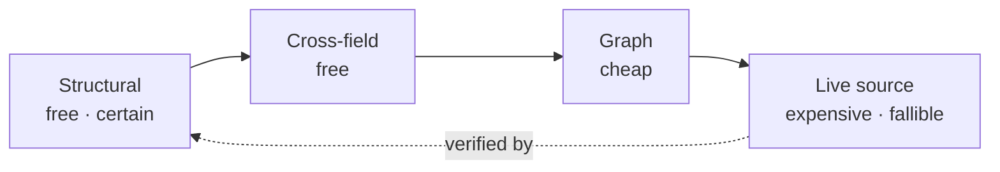
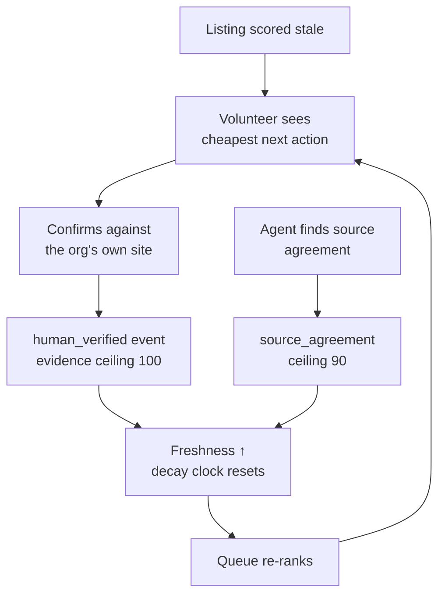

# Vision

> The problem this serves is stated in [PROBLEM.md](PROBLEM.md). Every number
> traces to [`FACTS.md`](FACTS.md).

## The idea

**Treat every fact in a civic directory as a claim with an expiry date and a
chain of custody.**

Not "is this record correct?" — that question is usually unanswerable and always
expensive. Instead: *what is the evidence that this is still true, how good is that
evidence, and how old is it?*

A directory that can answer that can route scarce human attention to the listings
where it buys the most, and can tell a person at 2am how much to trust what they
are reading.

## The one-line pitch

> A freshness and provenance layer for civic data — it finds what is provably
> broken, scores how stale everything else is, and tells a volunteer the single
> cheapest thing that would most improve the directory.

## What it is not

- **Not another directory.** ShelterTech's guide, chatbot and phone line already
  exist and are actively maintained. Building a competitor would be vanity.
- **Not an autocorrect.** Nothing is written back. Every output is a candidate for
  a human. `change_request` payloads are emitted to disk and never POSTed.
- **Not a judgement about ShelterTech.** They do the work. What is missing is an
  instrument, not effort.

## Design commitments

These are the things that must stay true, even when it costs capability.

### 1. Read-only against the source

Every request to the Service Guide is a `GET`. The tool cannot damage the thing it
is auditing, by construction rather than by policy.

### 2. Abstention is a first-class result

Four verdicts, not two:

| Verdict | Meaning | Can it reach a human as an error? |
|---|---|---|
| `supported` | The organisation's own site agrees | No — it raises the freshness score |
| `contradicted` | The site actively says otherwise | **Yes** |
| `absent` | The site is silent on this | **No** |
| `uncertain` | Evidence is mixed | No — queued as a question |

Collapsing `absent` into `contradicted` is the single mistake that produced most of
this project's retracted findings. It is now enforced in code and locked by tests.

### 3. Cheap and certain before expensive and doubtful

The tiers are not only a ladder — they compose. A cheap deterministic check can
*validate the output of* an expensive uncertain one. A model asked to cite a span
can be held to spans we built from bytes we fetched.

### 4. Nothing is asserted that was not measured

Six retractions taught this. Every claim in the repo traces to `FACTS.md` with the
command that establishes it. Estimates are labelled estimates. Fitted numbers are
labelled fitted.

### 5. The tool is polite

It honours `robots.txt`, budgets fetches, never parallelises requests to one host,
and identifies itself. It is pointed at underfunded nonprofits; it has no business
costing them bandwidth.

## Where it goes

### Now — an instrument

The freshness index scores all 813 approved listings, weighted per field, decaying
on per-field half-lives, with a ceiling on what each kind of evidence is worth.
Median today: **36.2/100** — because almost nothing carries evidence stronger than
"well-formed".

Structural checks find what is provably broken. Discovery reads each organisation's
own sitemap. Judgment is typed and calibrated, and abstains by default.

### Next — the evidence loop

The thing that makes the number move is people using it.

Every confirmation is an event with a timestamp and a source. That record is the
thing the directory does not currently have, and it is worth more than any single
correction — because it is what lets the *next* person skip the work.

### Later — the same instrument for everyone else

Nothing here is specific to San Francisco. Any civic directory — 211 services,
council listings, clinic finders — has the same shape: structured contact data,
prose eligibility rules, a source of truth that is the organisation's own website,
and no record of what was checked.

The generalisable parts are the four verdicts, the decay model, and discovery. The
specific part is one adapter per API.

### The end state

A person asks a question and gets an answer that carries its own confidence:

> *"Coordinated Entry at 123 Mission St, open until 5pm today. The phone number was
> confirmed against their own site 3 days ago. The opening hours have not been
> confirmed by anyone since 2022 — call before travelling."*

That last sentence is the whole product. It is not achievable by having better data.
It is achievable by **admitting what you don't know**, which requires recording what
you do.

## How we will know it worked

| Measure | Today | Target |
|---|---|---|
| Median freshness | 36.2 | 70 |
| Listings with any verification signal | 290 / 813 | all |
| False-positive rate on findings | **0 of 12 flagged, held out** | stays at 0 as the corpus grows |
| Structural defects outstanding | 8 | 0 |
| Cost to audit the full corpus | ~$0.26 | stays under $1 |

That third row is now measured rather than asserted. `calibrate.py` scores the
judge against a mechanical oracle over 444 (claim, page) rows from 43
organisations, split **by organisation** so no site's text crosses the split:
AUROC **0.992**, and at the chosen thresholds **precision 1.000 / recall 0.867**
held out, with **0 false accusations** among 12 contradictions raised.

The remaining honesty: this measures *faithfulness* — whether the judge reads a
page correctly — not *factuality*, which is whether the directory is right about
the world. A phone number can be correct and simply not published. Closing that
gap needs human review of the findings themselves, and that has not been done.

---

[PROBLEM.md](PROBLEM.md) · [ARCHITECTURE.md](ARCHITECTURE.md) · [FACTS.md](FACTS.md)
