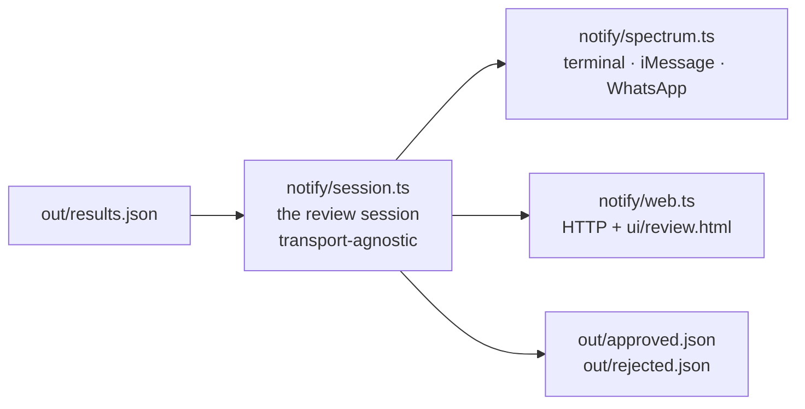

# notify/ — the volunteer review service

The audit (`run.py`) ends with a ranked queue of listings that need a human:
ones where the agent found the stored data contradicted by the organisation's
live website, and ones where it **abstained** because the evidence was too weak
to call. Both need a person.

ShelterTech's reviewers are volunteers, not staff at desks. So the queue is
delivered as a **conversation**, not a dashboard.

## One session, three transports



| File | What it is |
|---|---|
| `session.ts` | **The product.** Loads the queue, tracks position, formats each review, interprets replies, writes decisions. Imports nothing but `node:fs`, `node:path`, `node:url`. |
| `spectrum.ts` | Messaging transport. Spectrum's `terminal` provider by default; iMessage / WhatsApp Business with credentials. |
| `web.ts` | Web transport. A `node:http` server and a two-route JSON API. |
| `../ui/review.html` | The web chat UI. One self-contained file, vanilla JS, no build step, no CDN. |
| `dry_run.py` | A zero-dependency terminal mock-up of the conversation. Kept as a no-Node fallback demo. |

`session.ts` knows nothing about Spectrum, terminals, or HTTP. It sends by
calling a `Send` function it was handed and receives by having `handleText()`
called with a string. That is its entire interface to the outside world.

**The property that matters:** because all three transports share that one
module, a review answered in the web app and a review answered over iMessage
take the identical code path and write the **identical `change_request`
payload**. Verified — the two differ only in `decided_by`, `decided_via` and
`decided_at`. The transport decides how the words travel; it has no say in what
they mean.

---

## Run it — no credentials, no accounts

```bash
npm install

npm start      # terminal chat client
npm run web    # browser chat UI at http://127.0.0.1:8778/
```

Either one works with zero configuration.

`npm start` works because `terminal` is a first-class Spectrum provider and
`Spectrum({ providers })` is a supported, typed call shape with no `projectId`
or `projectSecret`. It is the real client and the real message loop, rendered in
a terminal instead of on a phone.

On first run the terminal provider downloads a small `tuichat` binary (~4.8 MB,
SHA256-verified) from the `photon-hq/tuichat` GitHub release and caches it in
`~/Library/Caches/tuichat/`. That one download needs network; the app itself
makes no other network calls. `npm run web` needs no download at all.

### What you can reply

There are **two kinds of review**, and they ask different questions.

**Discrepancy** — the agent read the org's site and thinks the stored value is
wrong. There is a proposed replacement.

| Reply | Meaning | Recorded in |
|---|---|---|
| `Y` | Yes, change it | `out/approved.json` (a change request) |
| `N` | No, the agent is wrong | `out/rejected.json` |

**Abstention** — the agent could *not* establish the truth (site unreachable,
JS-only, ambiguous). There is no proposed replacement, so there is nothing to
"confirm".

| Reply | Meaning | Recorded in |
|---|---|---|
| `R` | Looks right — **your** verification | `out/verified.json` |
| `F` | Needs fixing | `out/flagged.json` |

A `looks_right` is not a change request and is never written as one. It records
that a human checked the listing on this date — which, in a directory where 523
of 813 approved listings carry no verification signal at all (no `verified_at`,
no `certified_at`, no `certified` flag), is real progress. The listings are
maintained; what they lack is a record of what was confirmed.

Either kind:

| Reply | Meaning |
|---|---|
| `S` | Skip — not me, not now. Stays open for another reviewer. |
| `?` | Show everything the agent read. |
| `queue` | How many reviews are still open. |
| `help` | The command list. |
| `stop` | End the session with a summary. |

`yes` / `no` / `skip` and the slash forms (`/queue`, `/help`, `/stop`) work too.
In the web UI these are tappable buttons **and** typeable text.

### Driving the terminal non-interactively

The terminal client detects a non-TTY stdin and drops into plain readline mode,
so a whole session can be scripted:

```bash
printf 'help\n?\nY\nN\nS\nstop\n' | TUICHAT_QUIET=1 npm start
```

---

## The web transport

`npm run web` serves two things:

`notify/web.ts` is the whole application server — dashboard, review thread and
graph explorer, on one port.

| Route | Purpose |
|---|---|
| `GET /` | Dashboard (`ui/index.html`) |
| `GET /review` | Review thread (`ui/review.html`) |
| `GET /graph` | Graph explorer (`ui/graph.html`) |
| `GET /ui/*` | Static passthrough |
| `GET /api/results` | `out/results.json`, or `{}` |
| `GET /api/graph` | `out/graph.json`, or `{}` |
| `GET /api/state` | Recorded decisions + counts |
| `GET /api/review/current` | The open review, or `{done:true, summary}` |
| `POST /api/review/reply` | `{"action":"confirm\|reject\|skip\|looks_right\|needs_fixing"}` |
| `POST /api/run` | `{"budget":5}` — starts the audit pipeline |
| `GET /api/run/stream` | SSE: one event per stdout line, then `{done, ok}` |

`PORT` (default `8787`) and `HOST` (default `127.0.0.1`) are configurable.

The pipeline runs under `.venv/bin/python` when it exists, falling back to
`python3`. That matters: with a bare `python3` FalkorDB is unavailable and the
graph silently degrades to the in-memory fallback — the run still succeeds,
which is what makes the mistake easy to miss.

**Why polling, not SSE.** The transcript is an append-only log and the client
asks for "everything after N". That is stateless on both ends: no hanging
connection for a proxy to buffer, no reconnect bookkeeping, no duplicate
delivery, and a backgrounded phone tab catches up correctly on its next poll.
For a local demo the latency difference is imperceptible and the failure modes
are gone.

Replies are serialised through a promise chain, so two quick taps (or two open
tabs) can't both read the same open review and file two decisions for one
listing.

---

## Switch to iMessage

Same session module, same code path. Only the providers array changes.

```bash
export SPECTRUM_PROJECT_ID=...        # or PHOTON_PROJECT_ID
export SPECTRUM_PROJECT_SECRET=...    # or PHOTON_PROJECT_SECRET
export REVIEWER_PHONE=+14155550123    # the volunteer's number, E.164

npm start
```

All three must be set. With any of them missing the app stays on `terminal` —
it never half-starts, and it never silently fails to reach anyone.

> Never commit credentials. `.env` and `.env.*` are already in `.gitignore`.

### Before iMessage will deliver

On Photon's **Free / Pro** plans a project sends through a **shared pool** of
lines, and a shared line will only message recipients registered as **users** of
the project. Until the recipient is registered, a send fails with:

```
AuthenticationError: [spectrum-imessage] Target not allowed for this project
```

This is not an auth failure and not a region problem. Register the recipient:

```bash
npx @photon-ai/cli login
npx @photon-ai/cli spectrum users add --phone <E.164> --first-name <name>
```

or add them under **Users** at <https://app.photon.codes>. The Business plan
uses a dedicated line and is not subject to the allowlist.

The app detects this specific error and prints those instructions instead of a
gRPC stack trace.

### WhatsApp Business as well (optional)

Add these on top of the three above and `whatsapp-business` joins the providers
array. The inbound loop already serves every configured provider, so replies
from either platform land in the same handler.

```bash
export WHATSAPP_ACCESS_TOKEN=...
export WHATSAPP_PHONE_NUMBER_ID=...
export WHATSAPP_APP_SECRET=...      # optional
```

### Environment variable reference

| Variable | Required | Effect |
|---|---|---|
| `SPECTRUM_PROJECT_ID` / `PHOTON_PROJECT_ID` | for iMessage | Spectrum Cloud project id |
| `SPECTRUM_PROJECT_SECRET` / `PHOTON_PROJECT_SECRET` | for iMessage | Spectrum Cloud project secret |
| `REVIEWER_PHONE` | for iMessage | Volunteer's number, E.164 |
| `WHATSAPP_ACCESS_TOKEN` | no | Enables WhatsApp Business |
| `WHATSAPP_PHONE_NUMBER_ID` | no | Enables WhatsApp Business |
| `WHATSAPP_APP_SECRET` | no | WhatsApp webhook signature secret |
| `PORT` / `HOST` | no | Web transport bind address |
| `TUICHAT_QUIET` | no | Silences the terminal client's non-TTY notice |

---

## Read-only against production

**This service never POSTs to askdarcel.org.** There is no HTTP client in
`session.ts` or `spectrum.ts` at all, and `web.ts` only ever binds a local
listener.

A confirmed review is appended to `out/approved.json` as a `change_request`
payload, shaped for the endpoint ShelterTech's volunteers already use, and
stamped `"submitted_to_askdarcel": false`. A rejected one goes to
`out/rejected.json` — the agent being wrong is worth recording too.

The agent proposes, a volunteer judges, and a human with an account submits.
Three steps; this repo owns the first two and deliberately stops before the
third.

Decisions persist: confirmed and rejected listings are not offered again on a
later run. Skips are not persisted, because "skip" means *not me*, not *never*.

### Output shape

`out/approved.json` and `out/rejected.json` are JSON arrays. One entry:

```json
{
  "change_request": {
    "resource_id": 2258,
    "field": "phone",
    "current": "5106544000105",
    "proposed": "510.777.9560",
    "source_url": "https://www.feedingseniors.org",
    "source_quote": "…1721 Broadway #201, Oakland, CA, 94612 510.777.9560 (text or voice)…",
    "submitted_by": "darcel-watch (agent, human review required)"
  },
  "decision": "confirmed",
  "resource_id": 2258,
  "name": "Meals on Wheels of Alameda County",
  "agent_verdict": "discrepancy",
  "agent_confidence": 0.95,
  "blast_radius_size": 5,
  "decided_by": "web-reviewer",
  "decided_via": "web",
  "decided_at": "2026-09-19T23:38:40.996Z",
  "submitted_to_askdarcel": false,
  "note": "Recorded locally only. SF Service Guide Watch never POSTs to askdarcel.org — a human must submit this change request."
}
```

Only `decided_by`, `decided_via` and `decided_at` change between transports.

---

## Failure modes, all handled

| Situation | Behaviour |
|---|---|
| `out/results.json` missing | Message telling you to run `run.py`. Exit 0, no server started. |
| `out/results.json` not valid JSON | Parse error reported. Exit 0. |
| Queue empty | Says so. Exit 0. |
| Everything already reviewed | Says so, points at the decision files. Exit 0. |
| Malformed queue entries (nulls, wrong types, missing fields) | Skipped and counted, never rendered. No crash. |
| `out/approved.json` corrupt | Moved aside to `approved.json.corrupt-<ts>`, never overwritten. |
| Unrecognised reply | Nudge, and the review stays open. |
| iMessage recipient not allowlisted | Prints the exact remediation, not a stack trace. |
| Web server loses the browser | Client shows "Lost the server. Retrying…" and recovers on the next poll. |

## Typecheck

```bash
npm run typecheck
```

Node 24 runs these `.ts` files directly by stripping types, so there is no build
step. `tsconfig.json` sets `erasableSyntaxOnly` to guarantee they stay within
what Node can strip, and `allowImportingTsExtensions` because Node resolves the
real `./session.ts` file on disk.
